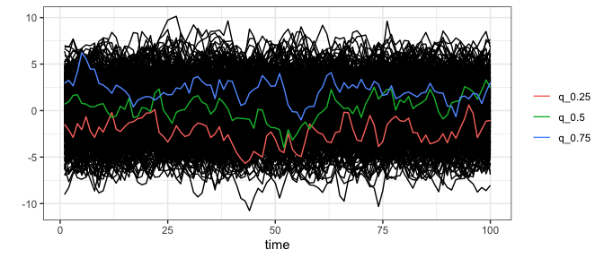

<!-- README.md is generated from README.Rmd. Please edit that file -->

# redq

## Fast Algorithm for Computing Empirical Dynamic Quantiles for Time Series

A semi-vectorised parallel-looped algorithm for computing empirical
dynamic quantiles for large temporal data sets.

## Installation

You could install the package from Github using

``` r
# install.packages("remotes")
remotes::install_github("szmsu2011/redq")
```

## Usage

``` r
library(redq)
library(purrr)
library(tidyr)

set.seed(2023)
arima_data <- map(seq_len(500), \(x) {
  arima.sim(list(ar = c(.95, -.1)), 100, mean = x / 500 - .5)
}) |>
  set_names(sprintf("ts%s", seq_len(500))) |>
  as_tibble()

(edq_data <- edq(arima_data, c(.25, .5, .75)))
#> # A tibble: 100 × 3
#>    q_0.25 q_0.5 q_0.75
#>  *  <dbl> <dbl>  <dbl>
#>  1 -1.47  0.688   2.95
#>  2 -2.09  0.952   3.25
#>  3 -2.89  1.63    2.66
#>  4 -1.40  1.70    4.14
#>  5 -2.06  0.783   6.23
#>  6 -0.656 0.699   5.57
#>  7 -2.21  0.412   4.47
#>  8 -2.87  0.417   4.44
#>  9 -1.77  0.647   2.94
#> 10 -2.31  0.746   2.74
#> # ℹ 90 more rows
```

``` r
library(dplyr)
library(ggplot2)

arima_data |>
  mutate(time = seq_len(nrow(arima_data))) |>
  pivot_longer(starts_with("ts")) |>
  ggplot(aes(time, value, group = name)) +
  geom_line() +
  geom_line(
    aes(col = name),
    data = edq_data |>
      mutate(time = seq_len(nrow(arima_data))) |>
      pivot_longer(starts_with("q_"))
  ) +
  theme_bw() +
  theme(legend.title = element_blank()) +
  labs(y = "")
```


